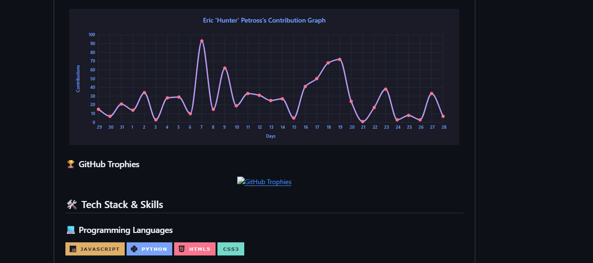

# 🌙 Eric 'Hunter' Petross | 10x Developer & AI Solutions Engineer

<p align="center">
  
</p>

<p align="center">
  
</p>

## 🎯 **Applied AI Solutions Engineer** | 🌟 **10x Developer** | 🧠 **LLM Specialist**

*Where code meets creativity and AI transforms possibilities* ✨

---

## 🚀 About Me



```bash
$ whoami
🎯 Applied AI Solutions Engineer & Full-Stack Developer
🌍 New England | JavaScript, AI/ML, LLMs | Code + Creativity
🎮 Modern-day digital archaeologist - if Indiana Jones coded!
```

## 🌐 Live Portfolio - Interactive Project Showcase

**🚀 [https://straydogsyn.github.io/Learner-Files-v3.5/](https://straydogsyn.github.io/Learner-Files-v3.5/)**

Explore my comprehensive web development portfolio featuring interactive projects, games, and applications! This live showcase demonstrates my full-stack capabilities and creative problem-solving approach:

### 🎮 Featured Interactive Projects

- **🧮 Advanced Calculator** - Complete with explosion effects for divide-by-zero operations and full keyboard support
- **🎲 Knucklebones Game** - Interactive dice-based strategy game with dynamic scoring
- **🗿 Rock Paper Scissors** - Classic game with modern UI and responsive design
- **📋 CompTIA Quiz** - Technical certification preparation tool with interactive questions
- **🎯 Interactive Navbar** - Showcase of navigation design patterns and accessibility features

### 💼 Professional Showcase

- **📄 Interactive Resume** - Comprehensive technical skills and professional experience
- **🏢 Company Portfolio** - StrayDog Syndications LLC project gallery
- **📱 Responsive Design** - Mobile-first approach with modern CSS and JavaScript

### 🛠️ Technical Highlights

- **Pure JavaScript** implementations with ES6+ features
- **Responsive CSS** with Tailwind and custom styling
- **Interactive Animations** and visual effects
- **Accessibility Features** with ARIA labels and keyboard navigation
- **Modern Web Standards** following best practices

*The portfolio is automatically deployed via GitHub Actions and showcases real-world applications of web development skills in action!*

## 📈 GitHub Analytics Dashboard

<div align="center">
  
### 🔥 Live Performance Metrics


</div>

<p align="center">
  
  
</p>

<p align="center">
  
</p>

<p align="center">
  
</p>

## 🏆 GitHub Achievements & Trophies

<div align="center">

### 🎯 Achievement Showcase

<p align="center">
  
</p>

### 📊 Contribution Insights


### 🌟 Special Achievements


</div>

## 🛠️ Tech Stack & Skills

### 💻 Programming Languages


### 🎨 Front-End Development


### ⚙️ Back-End Development


### 📊 Data Science & Analytics


### 🤖 AI & LLM Tools


### 🛠️ Development Tools & IDEs


### 🌐 Web Platforms & CMS


### 🔧 API & Testing Tools


## 🏆 Certifications & Professional Credentials

<div align="center">

### 🎓 Verified Professional Development


</div>

### 🍃 MongoDB Certifications


### 🚀 Full-Stack Development


### 💻 JavaScript & Web Development


### 🎨 Creative & Technical Skills


### 📊 Data Analysis & Testing


### 🤝 Professional Development


## 🎯 Coding Challenges & Practice

<div align="center">

### 💪 Active Problem Solving


</div>

<p align="center">
  <a href="https://www.codewars.com/users/StrayDogSyn"></a>
</p>

<p align="center">
  <a href="https://leetcode.com/u/StrayDogSyn/"></a>
  <a href="https://www.hackerrank.com/profile/straydogsyndica1"></a>
</p>

## 👨‍💻 Experience

### Outlier AI, Remote — *AI Content Writer*

#### October 2024 - Present

- **Rewriting the Future:** Revised and fine-tuned written content to perfectly align with client visions and publisher needs.
- **Predictive Prowess:** Tested, validated, and optimized models to ensure accurate predictions.
- **Innovative Application Development:** Developed new functions and applications to drive insightful analyses.
- **Customer Champion:** Provided high-quality, friendly support that left clients smiling and satisfied.
- **Team Dynamo:** Collaborated closely with team members to hit deadlines and achieve ambitious project targets.

## 🎓 Education & Professional Development

<div align="center">

### 📚 Academic Excellence & Continuous Learning


</div>

### 🏫 Formal Education

#### **Associate in Applied Science - Computer & Networking Technology**

*Community College of Rhode Island* | **2020 - Present**

<div align="left">


</div>

**📋 Core Coursework & Technical Focus:**

- **Network Infrastructure:** TCP/IP, OSI Model, Network Protocols, Subnetting
- **Hardware Systems:** Computer Architecture, Hardware Troubleshooting, System Assembly
- **Operating Systems:** Windows Server Administration, Linux Fundamentals
- **Security Fundamentals:** Network Security, Cybersecurity Principles
- **Programming Foundations:** Logic Development, Algorithm Design
- **Database Management:** SQL Fundamentals, Data Structure Design
- **Project Management:** Technical Documentation, Team Collaboration

**🏆 Academic Achievements:**

- **Dean's List Recognition** - Multiple semesters for academic excellence
- **STEM Pathway Scholar** - Specialized track in Science, Technology, Engineering & Math
- **Consistent Academic Performance** - Maintained 3.40+ GPA throughout program
- **Hands-on Laboratory Excellence** - Practical application of networking concepts

### 🚀 Professional Development & Specialized Training

#### **Applied AI Solutions Engineering**

*Self-Directed Professional Development* | **2023 - Present**

**🤖 AI/ML Specialization:**

- **Large Language Models (LLMs):** Advanced prompt engineering, model fine-tuning
- **Vector Databases:** MongoDB Atlas Vector Search, semantic similarity
- **AI Agent Development:** Multi-tool reasoning agents, memory systems
- **Machine Learning:** Python-based ML workflows, data preprocessing
- **Natural Language Processing:** Text analysis, sentiment analysis, content generation

**📊 Technical Implementation:**

- Built production-ready AI applications with real-world deployment
- Integrated multiple AI services (OpenAI, Anthropic, Google Gemini)
- Developed custom AI workflows for content creation and analysis
- Implemented vector search solutions for intelligent data retrieval

#### **Full-Stack Web Development Mastery**

*Comprehensive Self-Study & Project-Based Learning* | **2022 - Present**

**🌐 Frontend Excellence:**

- **Modern JavaScript:** ES6+, Async/Await, Module Systems, DOM Manipulation
- **React Ecosystem:** Component architecture, state management, hooks
- **CSS Mastery:** Flexbox, Grid, Animations, Responsive Design
- **UI/UX Design:** User-centered design, accessibility standards (WCAG)
- **Performance Optimization:** Code splitting, lazy loading, bundle optimization

**⚙️ Backend Proficiency:**

- **Node.js Development:** Express.js, RESTful APIs, middleware architecture
- **Database Design:** MongoDB, SQL, data modeling, query optimization
- **Authentication & Security:** JWT, OAuth, secure coding practices
- **DevOps Fundamentals:** Git workflows, CI/CD, deployment strategies

### 🎯 Industry-Relevant Skills & Competencies

#### **💼 Professional Skills**

- **Project Management:** Agile methodologies, sprint planning, task prioritization
- **Technical Communication:** Documentation, code reviews, stakeholder presentations
- **Problem-Solving:** Analytical thinking, debugging, root cause analysis
- **Team Collaboration:** Cross-functional teamwork, mentoring, knowledge sharing
- **Continuous Learning:** Technology trend analysis, skill gap assessment

#### **🔧 Technical Proficiencies**

- **Programming Languages:** JavaScript (Expert), Python (Intermediate), HTML5/CSS3 (Expert)
- **Frameworks & Libraries:** React, Node.js, Express.js, Bootstrap, Tailwind CSS
- **Development Tools:** VS Code, Git/GitHub, Chrome DevTools, Postman
- **AI/ML Tools:** OpenAI API, MongoDB Vector Search, Pandas, NumPy
- **Cloud & Deployment:** GitHub Actions, Vercel, basic AWS knowledge

### 📈 Continuous Education & Future Goals

**🎯 Current Learning Objectives (2025):**

- **Advanced AI Engineering:** Deep learning frameworks, model deployment
- **Cloud Architecture:** AWS/Azure certifications, microservices design
- **Cybersecurity:** Network security, ethical hacking, security auditing
- **Mobile Development:** React Native, cross-platform applications

**🏆 Planned Certifications:**

- **AWS Solutions Architect Associate**
- **CompTIA Security+**
- **MongoDB Developer Certification**
- **Google Cloud Professional AI Engineer**

**📚 Academic Completion Timeline:**

- **Expected Graduation:** Spring 2026
- **Capstone Project:** AI-powered network monitoring system
- **Internship Goals:** Software development or cybersecurity role

## 🌟 Featured Projects

### **🌐 Interactive Web Development Portfolio**

**🚀 [Live Demo](https://straydogsyn.github.io/Learner-Files-v3.5/)** | **📂 [Repository](https://github.com/StrayDogSyn/Learner-Files)**

- **Technologies:** HTML5, CSS3, JavaScript (ES6+), Tailwind CSS, Bootstrap, GitHub Actions
- **Highlights:** A comprehensive showcase of interactive web applications featuring:
  - Advanced calculator with explosion effects and keyboard support
  - Interactive games (Knucklebones, Rock Paper Scissors)
  - Technical quiz applications and educational tools
  - Responsive design with modern CSS animations
  - Automated deployment via GitHub Actions
- **Features:** Mobile-first responsive design, accessibility compliance, interactive animations

### **🤖 AI Agent Development Projects**

- **MongoDB Vector Search Integration:** Built intelligent agents leveraging MongoDB's vector search capabilities
- **LLM Integration:** Developed applications integrating large language models for enhanced user interactions
- **Multi-Tool Agent Architecture:** Designed agents with reasoning, memory, and tool integration capabilities

## 📫 Connect with the Digital Ecosystem

<div align="center">

### 🌐 Professional Network


</div>

### 🌟 **Primary Channels**

<p align="center">
  <a href="https://straydogsyn.github.io/Learner-Files-v3.5/"></a>
  <a href="https://straydogsyn.github.io/Learner-Files-v3.5/"></a>
  <a href="https://linkedin.com/in/eric-petross"></a>
</p>

### 🎯 **Let's Build Something Amazing Together!**

> "Code is poetry written in logic, and every bug is just a plot twist waiting to be resolved."  
> — Eric 'Hunter' Petross

**🚀 Ready to transform ideas into digital reality**  
**⚡ Available for innovative projects and collaborations**  
**🌟 Let's create the future, one line of code at a time**

<p align="center">
  
</p>

---

<p align="center">
  
</p>
